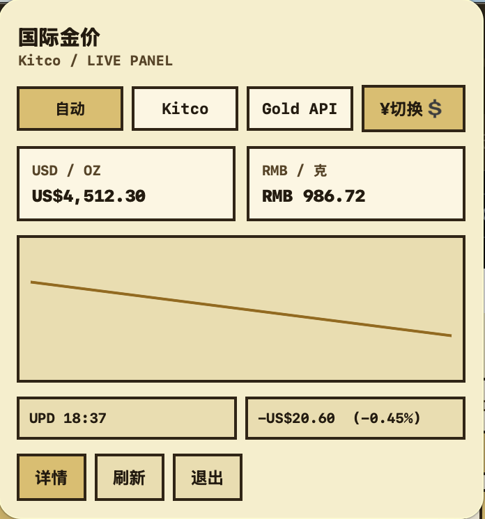
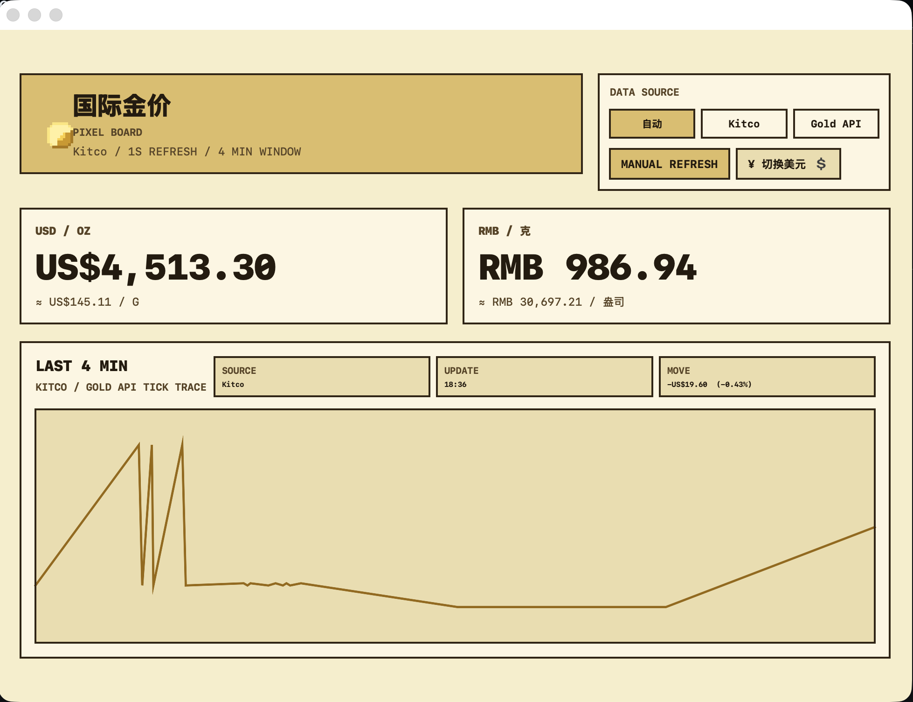

# GoldPrice for macOS

[English](README.md) | [简体中文](README.zh-CN.md)

`GoldPrice` 是一个原生 SwiftUI macOS 菜单栏投资辅助工具，实时追踪国际金价并分析与其他金融指标（白银、原油、美元指数、美债收益率、汇率）的相关性，支持 `USD / OZ` 和 `¥ / 克` 双币种显示，带有桌面小组件和独立详情窗口。


## 预览

### 主面板（Dashboard）



### 菜单栏面板



## 功能

- 常驻菜单栏，点击即可查看金价（默认人民币/克）
- 主应用每秒刷新金价，其他数据源按免费 API 频率自动轮询
- 同时显示 `美元/盎司` 和 `人民币/克`
- 多数据源：黄金、白银、WTI 原油、美元指数 DXY、10 年期美债收益率、USD/CNY 汇率
- 相关性分析：皮尔逊相关系数（30天/90天/180天/1年），滚动 Beta，背离率
- 三栏详情窗口：数据源面板 + 走势图 + 相关性矩阵
- 渐进式历史数据回填（最近优先，20 年日线，断电续传）
- 支持手动切换数据源：`自动`、`Kitco`、`Gold API`
- 价格提醒：设定目标价，穿越时菜单栏闪烁 + 提示音 + 面板横幅通知
- 提醒历史：可回溯所有触发过的提醒及时间
- 支持 `systemSmall` 和 `systemMedium` 桌面小组件
- 纯原生 SwiftUI 实现，零第三方依赖（SQLite 用系统 libsqlite3）

## 系统要求

- macOS 14 或更高版本
- Xcode 15 或更高版本
- 可访问公开金价数据源的网络连接

## 快速开始

1. 用 Xcode 打开 `GoldPrice.xcodeproj`
2. 选择 `GoldPrice` scheme
3. 在 `Signing & Capabilities` 中为 `GoldPrice` 和 `GoldPriceWidgetExtension` 分配 Team
4. 如果默认的 `com.example.*` bundle identifier 冲突，请替换为你自己的
5. 运行目标选择 `My Mac`
6. 按 `Cmd + R` 运行

首次启动后，应用入口在 macOS 菜单栏。点击金价数字打开面板，点击 `详情` 打开完整窗口。

## 文档

- [使用手册](docs/USAGE.md)
- [构建与发布](docs/BUILD_AND_RELEASE.md)
- [贡献指南](CONTRIBUTING.md)

中文版本：

- [使用手册](docs/USAGE.zh-CN.md)
- [构建与发布](docs/BUILD_AND_RELEASE.zh-CN.md)
- [贡献指南](CONTRIBUTING.zh-CN.md)

## 数据来源

| 数据源 | 实时来源 | 历史来源 | 刷新频率 |
|--------|---------|---------|---------|
| 黄金 XAU | Kitco 网页解析 + Gold API 兜底 | Yahoo Finance GC=F | 1 秒 |
| 白银 XAG | Kitco 网页解析 | Yahoo Finance SI=F | 1 秒 |
| WTI 原油 | Yahoo Finance CL=F | Yahoo Finance CL=F | 5 分钟 |
| 美元指数 DXY | FRED API (DTWEXBGS) | FRED API | 5 分钟 |
| 10Y 美债 | FRED API (DGS10) | FRED API | 5 分钟 |
| USD/CNY 汇率 | FRED API (DEXCHUS) | FRED API | 5 分钟 |

`人民币/克` 价格从 Kitco 报价源中一同解析出的 `USD/CNY` 汇率计算得出。FRED API 需注册免费 key 存入 `.env`。

历史数据采用渐进式回填：优先拉取最近 90 天保证相关性分析立即可用，然后每 60 秒拉取 90 天历史，逐步覆盖 20 年日线。

## 刷新策略

- 菜单栏面板和详情窗口：每秒刷新一次
- 小组件：刷新频率由 `WidgetKit` 控制

这意味着真正的秒级更新仅适用于主应用，不适用于小组件。短期走势图仅在报价源返回新数据时推进。

## 项目结构

```text
GoldPriceApp/
  GoldPriceApp.swift              # 应用入口，数据源注册
  MenuBarViews.swift              # 菜单栏弹出面板
  ContentView.swift               # 三栏详情窗口
  CorrelationView.swift           # 相关性面板
  GoldPriceViewModel.swift        # 主视图模型
  DashboardWindowController.swift # 窗口控制器

GoldPriceWidget/
  GoldPriceWidget.swift           # 桌面小组件

Shared/
  DataSourceProtocol.swift        # 数据源协议 + 通用模型
  DataSourceManager.swift         # 多数据源调度中心
  GoldDataSource.swift            # 黄金数据源
  SilverDataSource.swift          # 白银数据源
  OilDataSource.swift             # 原油数据源
  DXYDataSource.swift             # 美元指数数据源
  UST10YDataSource.swift          # 10Y 美债数据源
  ExchangeRateDataSource.swift    # 汇率数据源
  MetalQuoteParser.swift          # Kitco 页面解析器
  FREDHelpers.swift               # FRED API 工具
  YahooFinanceHistory.swift       # Yahoo Finance 历史数据
  DatabaseManager.swift           # SQLite 持久化（actor）
  CorrelationEngine.swift         # 皮尔逊相关性引擎
  CorrelationModels.swift         # 相关性数据模型
  GoldPriceService.swift          # 旧版金价服务（兼容）
  GoldPriceModels.swift           # 金价数据模型
  Formatting.swift                # 格式化 + 日志
  GoldPriceTheme.swift            # 像素主题
```

## 本地构建

无签名本地构建：

```bash
DEVELOPER_DIR=/Applications/Xcode.app/Contents/Developer \
/Applications/Xcode.app/Contents/Developer/usr/bin/xcodebuild \
  -project GoldPrice.xcodeproj \
  -scheme GoldPrice \
  -configuration Debug \
  -derivedDataPath ./.build/DerivedData \
  CODE_SIGNING_ALLOWED=NO \
  CODE_SIGNING_REQUIRED=NO \
  build
```

## 已知限制

- 小组件无法每秒刷新
- 金价解析依赖第三方页面结构和公开 API
- 仓库暂未包含签名和公证自动化
- 仓库暂未包含 `LICENSE` 文件

## 贡献

欢迎提交 Issue 和 Pull Request。在进行较大改动之前，请先阅读[贡献指南](CONTRIBUTING.md)。

## 许可证

尚未添加许可证文件。如果你计划公开发布此仓库，请在此之前确定许可证。
